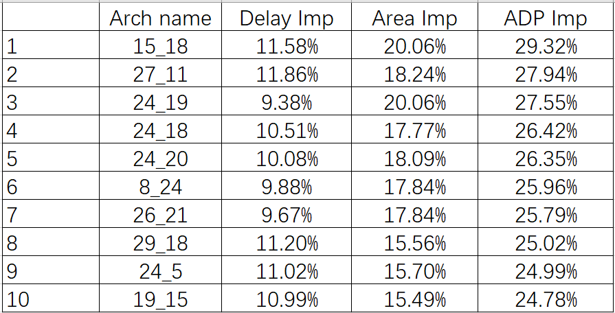
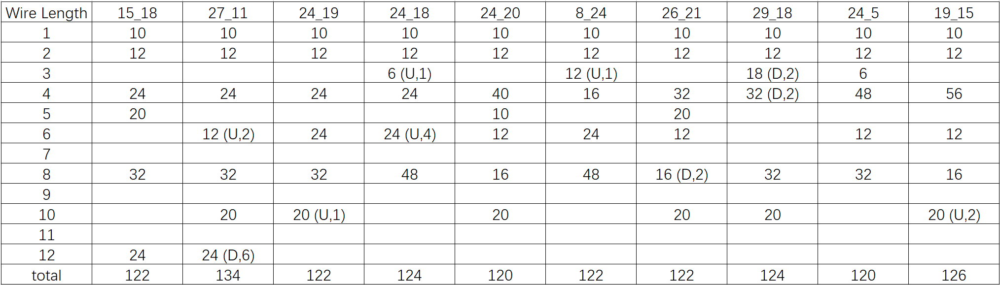
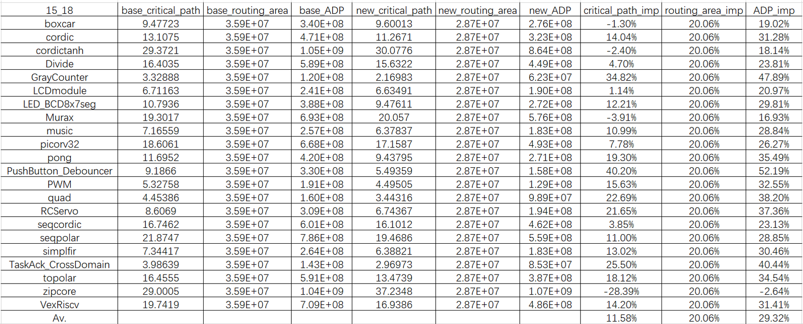
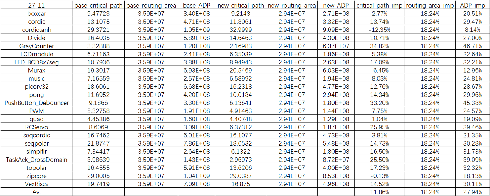

Experimental Results
====================

VIB architecture parameterization
---------------------------------

The search platform explores routing wires with lengths ranging from 1 to 12, represented by \( n = [n_1, n_2, \dots, n_{12}] \), where these 12 values correspond to the number of routing wires for each length. Additionally, it is specified that routing wires with the same length share the same bending pattern, with a maximum of one bend. The bend position and direction for each wire are represented by \( b = [b_1, b_2, \dots, b_{12}] \) and \( c = [c_1, c_2, \dots, c_{12}] \), respectively. Based on empirical routing architectures, the number of different wire types should vary. For instance, shorter wires (e.g., 1x, 2x lines) should have more connections, while longer wires should be fewer in number. To improve search efficiency, we define upper and lower bounds for each wire type, with specific distributions provided in Table below.

.. table:: The upper and lower bounds for each wire type.
   :widths: auto

   +------------+------------+-----------+
   | Wire       | Upper Num  | Lower Num |
   +============+============+===========+
   | l1         | 10         | 30        |
   +------------+------------+-----------+
   | l2         | 12         | 48        |
   +------------+------------+-----------+
   | l3         | 0          | 48        |
   +------------+------------+-----------+
   | l4         | 0          | 64        |
   +------------+------------+-----------+
   | l5         | 0          | 50        |
   +------------+------------+-----------+
   | l6         | 0          | 60        |
   +------------+------------+-----------+
   | l7         | 0          | 0         |
   +------------+------------+-----------+
   | l8         | 0          | 48        |
   +------------+------------+-----------+
   | l9         | 0          | 0         |
   +------------+------------+-----------+
   | l10        | 0          | 40        |
   +------------+------------+-----------+
   | l11        | 0          | 44        |
   +------------+------------+-----------+
   | l12        | 0          | 48        |
   +------------+------------+-----------+
   
Exploration Results
-------------------
In the Linux version 3.10.0-1160.el7.x86_64 environment, with the CPU being Intel(R) Xeon(R) Platinum 8354H CPU @ 3.10GHz, 30 cores were used for parallel iterative architecture generation, resulting in a total of 634 iterations.

The best 10 architectures compared to the baseline are shown in Figure 1.

    
    Figure 1. The best 10 archs.
    
In Figure 1, `Delay Imp` refers to the percentage reduction in critical path delay, `Area Imp` refers to the percentage reduction in routing area, and `ADP Imp` refers to the percentage reduction in area-delay product.
The Arch name m_n represents the n-th architecture generated in the m-th thread.

The distribution of various line types for these ten architectures is shown in Figure 2.

    
    Figure 2. The wire distribution of ten architectures.
    
In the parentheses in Figure 2, U and D represent counterclockwise and clockwise bends, respectively. Besides, The numbers in parentheses represent the position of the bend.

The information for each benchmark circuit implemented by the two optimal architectures is shown in Figure 3 and Figure 4.

    
    Figure 3. The detailed results of architecture 15_18.
    

    
    Figure 4. The detailed results of architecture 27_11.

