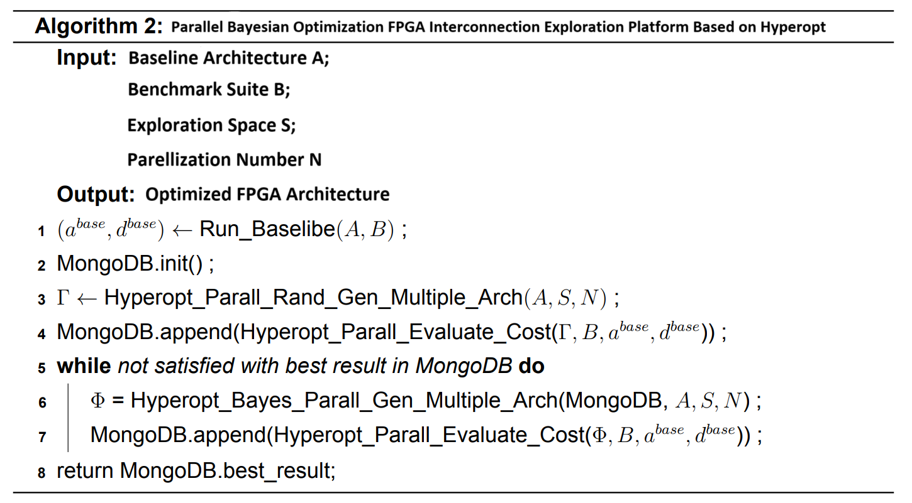

Exploration Platform Based on Bayesian Optimization
===================================================

The architecture exploration platform is based on the baseline architecture, improved to the VIB architecture, and aims to search for interconnection architectures with better performance (such as area, latency, etc.). To enhance optimization efficiency, the exploration platform has built a parallel Bayesian optimization FPGA interconnection architecture exploration platform based on Hyperopt. Starting from the initial solution, the platform repeatedly performs the process of "generating new solutions → calculating objective function differences → using Bayesian optimization to recommend multiple search points" on the data in MongoDB, until the objective function converges or the requirements are met. In this process, Hyperopt's parallelization support is achieved through the MongoDB database, enabling result storage and communication between different threads, thereby improving optimization efficiency.The pseudocode for the upgraded exploration platform is shown in Figure 1.

    
    Figure 1. The pseudocode for the upgraded exploration platform.

First, the algorithm takes the existing Baseline architecture A, a set of benchmarks, and the search space as inputs. After the algorithm starts running, it first executes the `Run_Baseline()` function to evaluate the performance of the Baseline architecture A under the given benchmark set, recording corresponding parameters such as area and critical path delay.

Next, the MongoDB database is initialized for future use. The exploration platform then randomly modifies the Baseline architecture based on the search space, generating multiple architectural variants (Arch). The `Hyperopt_Parall_Evaluate_Cost()` function then calls VPR to perform parallel layout and routing of the generated interconnection architectures using the given benchmark set, obtaining average critical path and area information. MongoDB stores the parameters corresponding to each Arch and its benchmark results, preparing for the first inference of Bayesian optimization.

The Bayesian inference is based on the existing data in MongoDB, modeling the objective function and simultaneously recommending multiple points for evaluation. The evaluation criterion is to minimize the area-delay product.
