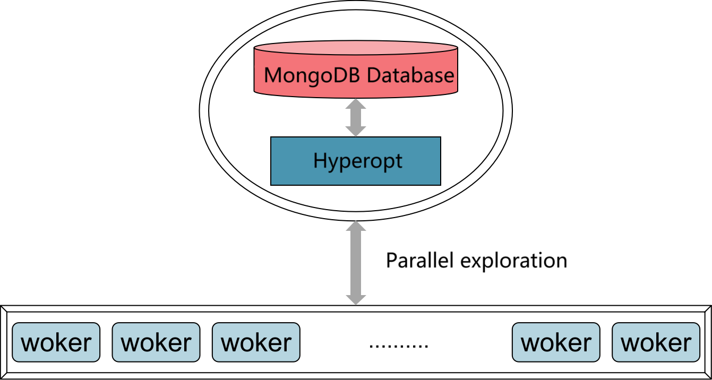

Hyperopt Package
================

Introduction
--------------------------
Hyperopt is a distributed Bayesian optimization Python library for hyperparameter optimization, developed by James Bergstra. It can optimize optimization problems with hundreds of parameters over a wide range. Hyperopt supports a variety of parameter types, which are explained as follows:

- **hp.choice(label, options)**: Returns one element from `options`, which can be a list or tuple. `options` also supports conditional parameters, where different options may have different subspaces.
  
- **hp.randint(label, upper)**: Returns an integer within the range [0, upper). Compared to **hp.quniform(label, low, high, q)**, this is more suitable when the parameter values are not correlated, meaning the function is not smooth.

- **hp.uniform(label, low, high)**: Returns a value uniformly distributed between `low` and `high`.

- **hp.quniform(label, low, high, q)**: Returns an integer that is `round(uniform(low, high) / q) * q`. Compared to **hp.randint(label, upper)**, this is more suitable for cases where the objective function is smooth.

- **hp.loguniform(label, low, high)**: Returns `exp(uniform(low, high))`, which applies a logarithmic transformation to the uniformly distributed variable.

- **hp.qloguniform(label, low, high, q)**: Returns `round(exp(uniform(low, high)) / q) * q`.

- **hp.normal(label, mu, sigma)**: Returns a value from a normal distribution with mean `mu` and standard deviation `sigma`, suitable for cases where you want to search around certain values.

These are some of the more commonly used parameter types in Hyperopt. In addition, there are less commonly used types such as **hp.qnormal(label, mu, sigma, q)**, **hp.lognormal(label, mu, sigma)**, and **hp.qlognormal(label, mu, sigma, q)**. For specific details, please refer to the Hyperopt documentation.

Parallelization support
--------------------------
Conventional Bayesian Optimization uses a sequential optimization algorithm, which cannot be parallelized. However, due to the inefficiency of serial Bayesian optimization, researchers have developed a series of parallelization methods. The key challenge is recommending multiple exploration points at once through the acquisition function in Bayesian optimization. Hyperopt has built-in support for parallelization and enables result storage and communication between different threads through the MongoDB database.

Figure 1 is a schematic diagram of the parallelization principle in Hyperopt. MongoDB is an open-source database system written in C++ that is based on distributed file storage. Similar to JSON objects, MongoDB stores data as documents, with the data structure consisting of key-value pairs. Field values can contain other documents, arrays, and arrays of documents. Centered around MongoDB, Hyperopt stores the optimization results and the parameter combinations recommended by the acquisition function in MongoDB. It communicates asynchronously with the workers responsible for the actual evaluation processes.

    
Figure 1. Schematic diagram of the parallelization principle in Hyperopt.
